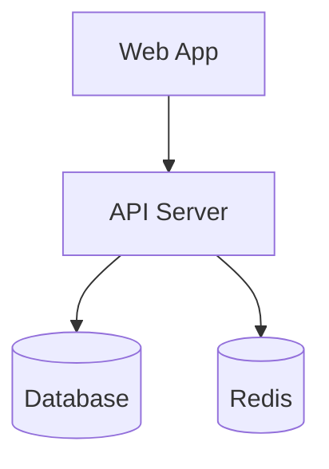

# architect — 架构梳理

## Goal

1. 一句话定位 + 服务边界图
2. NFR 基线
3. 模块清单 + 依赖规则
4. ADR 索引
5. 跨模块契约
6. 扩展点 + 容量边界
7. 深度挖掘机会
8. 产出 ARCHITECTURE.md

## Workflow

### 第一步 · 模式选择

| 条件 | 模式 |
|------|------|
| 首次运行 | 4 步（建立基线） |
| 已有 ARCHITECTURE.md | 6 步（增量更新 + 比对） |

### 第二步 · 加载输入

- 读 `docs/andao_specs/CONTEXT.md`
- 读 `docs/andao_adr/adr/`
- 读已有 `ARCHITECTURE.md`（如存在）

### 第三步 · 一句话定位 + 服务边界图

一句话描述项目定位：
```
<项目名> 是一个 <类型>，用于 <核心价值>。
```

输出 Mermaid 模块关系图：



### 第四步 · NFR 基线

| 指标 | 当前值 | 目标值 |
|------|--------|--------|
| QPS | <value> | <target> |
| P99 延迟 | <value> | <target> |
| DAU | <value> | <target> |
| 可用性 | <value> | <target> |

### 第五步 · 模块清单 + 依赖规则

从 `src/` / `lib/` / `app/` 提取模块：

```
## 模块：用户认证（src/auth/）
- 依赖：数据库（src/db/）
- 被依赖：API 路由（src/routes/）
- 规则：不可直接访问外部服务
```

### 第六步 · ADR 索引

从 `docs/andao_adr/adr/` 读取已有 ADR，建立索引表：

| ADR | 标题 | 状态 | 影响模块 |
|-----|------|------|---------|
| 001 | 使用 Prisma 作为 ORM | 已接受 | 数据库层 |
| 002 | 采用 JWT 鉴权 | 已接受 | 用户认证 |

### 第七步 · 跨模块契约

定义模块间的接口契约（API 端点、事件、数据格式）：

```
## 跨模块契约：Auth → User
- 接口：getUser(token: string) → User | null
- 事件：user.created → { id, email }
```

### 第八步 · 扩展点 + 容量边界

```
## 扩展点
- 认证模块可插拔策略：email / OAuth / SSO
## 容量边界
- 单实例数据库连接池：10 连接
- 超过需要加读副本
```

### 第九步 · 深度挖掘机会

基于 codebase-design vocabulary，识别加深机会：

| 模式 | 发现 |
|------|------|
| 浅接口 | <模块> 暴露了太多配置参数 |
| 缺失接缝（Seam） | <模块> 直接调用了外部服务，没有适配器层 |
| 重复抽象 | <模块 A> 和 <模块 B> 做了类似的事 |
| 耦合 | <模块> 直接 import 了底层实现 |

### 第十步 · 产出

路径：`docs/andao_specs/ARCHITECTURE.md`

## 约束

- 不修改业务代码
- ADR 推翻成本必填（低/中/高）
