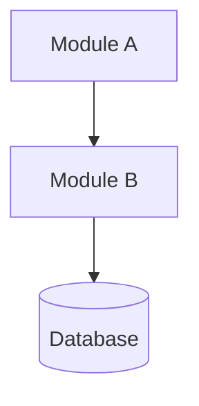

# design — 技术设计（阶段 2）

## Goal

1. 技术栈选型确认
2. 架构级变更二次检测
3. 技术决策（理由 + 取舍）
4. 架构图（ASCII/Mermaid）
5. ADR 记录
6. 风险管理
7. §9 架构沉淀建议
8. 产出 DESIGN.md

## Workflow

### 第一步 · Preflight Gate

检查 `docs/andao_specs/<change-id>/MODEL.md` + `PROPOSAL.md` 存在。

### 第二步 · 加载输入

- 读 `docs/andao_specs/<change-id>/PROPOSAL.md`
- 读 `docs/andao_specs/<change-id>/MODEL.md`
- 读 `docs/andao_specs/CONTEXT.md`
- 读 `docs/andao_adr/adr/`（如有）

### 第三步 · 技术栈选型

询问用户技术栈偏好（首次需要，后续复用 CONTEXT.md）：

| 维度 | 选项卡片 |
|------|---------|
| 框架 | React / Vue / Svelte / 无 |
| 后端 | Express / FastAPI / Go / 无 |
| 数据库 | PostgreSQL / MySQL / SQLite / 无变更 |
| 测试 | Vitest / Jest / Pytest / 已有 |

展示 5–6 张卡片让用户选择。已有项目的绑定技术栈直接复用。

### 第四步 · 架构级变更检测

检查本次变更是否涉及：
- 新增模块 / 微服务
- 修改数据流
- 变更技术栈
- 修改跨模块契约

涉及以上任一 → 标记 `architecture-change: true` 并提醒用户"本次涉及架构变更，建议在 design 完成后同步跑 architect"。

### 第五步 · 技术决策

每个决策按以下结构记录：

```
## 决策：<标题>
- 选项：<A / B / C>
- 选择：<选哪个>
- 理由：<为什么>
- 取舍：<放弃了什么>
- 代价：<选了这个要付出什么>
```

决策清单至少包含：

| 决策 | 说明 |
|------|------|
| 文件/模块结构 | 新增文件的目录位置，修改哪些文件 |
| 数据库 | Schema 变更、迁移策略 |
| 接口 | API 端点、组件 Props、事件 |
| 状态管理 | 全局/本地状态策略 |
| 测试策略 | 每层用什么测试框架 |

### 第六步 · 架构图

输出 ASCII 或 Mermaid 图：



### 第七步 · ADR 记录

对以下类型的决策写入 ADR：
- 难逆转的
- 没有上下文会很意外的
- 涉及真实取舍的

ADR 写入 `docs/andao_adr/adr/<NNN>-<title>.md`：

```markdown
# ADR-<NNN>：<标题>
- 状态：已提议 | 已接受 | 已废弃
- 决定：<我们决定>
- 理由：<因为>
- 取舍：<代价>
- 否决成本：低 / 中 / 高
```

### 第八步 · 风险管理

至少 3 项风险：

```
## 风险 1：<标题>
- 概率：高/中/低
- 影响：高/中/低
- 缓解措施：<做法>
```

### 第九步 · §9 架构沉淀建议

记录可供未来参考的架构经验（`evolve` 技能会批量同步）：

```yaml
## §9 架构沉淀建议
- type: abstraction | decision | contract | dependency | forbidden
  description: 建议内容
  evolved: false
```

### 第十步 · 产出 DESIGN.md

路径：`docs/andao_specs/<change-id>/DESIGN.md`

### 第十一步 · 更新 STATE.md

```yaml
current_phase: design
```

### 第十二步 · 确认完成

```
✅ DESIGN.md 已生成（docs/andao_specs/<change-id>/DESIGN.md）
ADR 数量：<N> 条
架构变更：<是 / 否>

前端项目 → 准备进入 ui-design
非前端项目 → 准备进入 slice
继续吗？
```

用户确认 → 前端项目路由到 `ui-design`，非前端路由到 `slice`。

## 约束

- 禁止写完整代码实现
- 每个决策必须提供理由 + 取舍
- §9 的 `evolved` 初始值必须为 `false`
